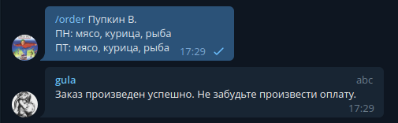

# Gula Bot

## Описание:
**Бот для заказа корпоративных обедов. Напоминает каждое утро заказать обед (по заранее указаному времени) и может производить записи в Google таблицы.**

## Как начать
TODO

## Команды

- `/start` 

- **`/notify` или `/notify $TIME` - где `$TIME` время в формате `HH:MM`**

- **`/order $NAME $ORDER` - где `$NAME` имя в формате `Пупкин В.`, а `$ORDER` заказ в формате строки.**

